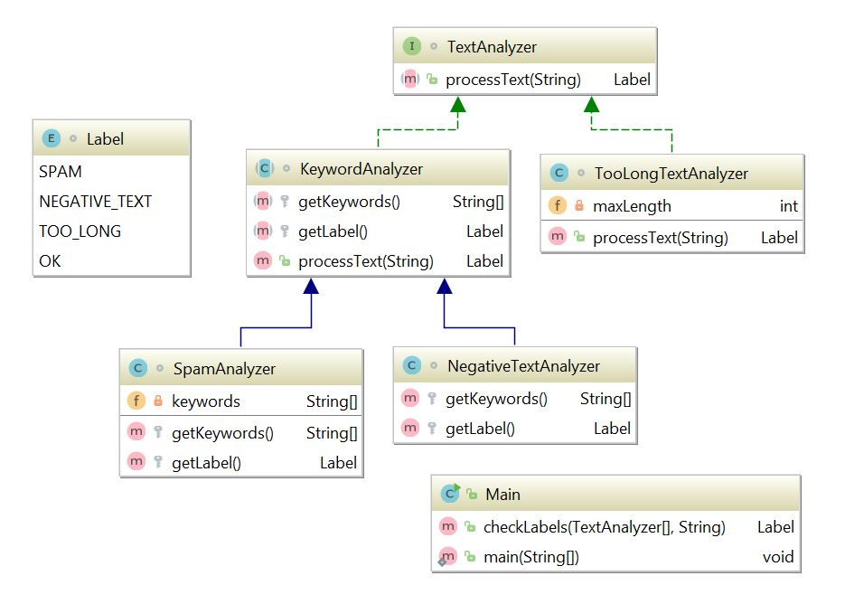

Задача с платформы Stepik отсюда: https://stepik.org/lesson/14513/step/9?unit=4147

**Цель**: познакомиться с интерфейсами и абстрактными класснами Java.

**Краткое описание задачи:**  
Представим, вы делаете систему фильтрации комментариев на каком-то веб-портале, будь то новости, видео-хостинг, а может даже для системы онлайн-обучения :)

Допустим, мы будем фильтровать спам, комментарии с негативным содержанием и слишком длинные комментарии.  
* Спам будем фильтровать по наличию указанных ключевых слов в тексте.  
* Негативное содержание будем определять по наличию одного из трех смайликов – :( =( :|  
* Слишком длинные комментарии будем определять исходя из данного числа – максимальной длины комментария.

Пример наследования:
